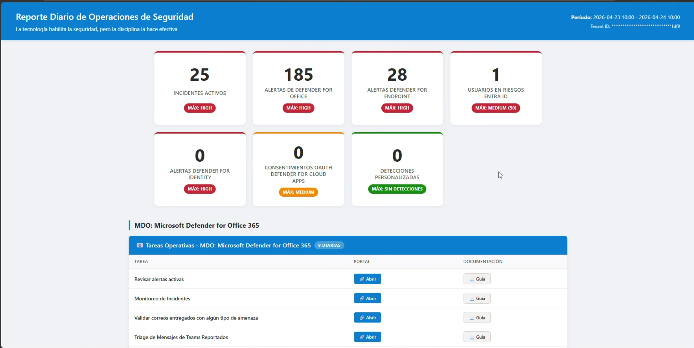
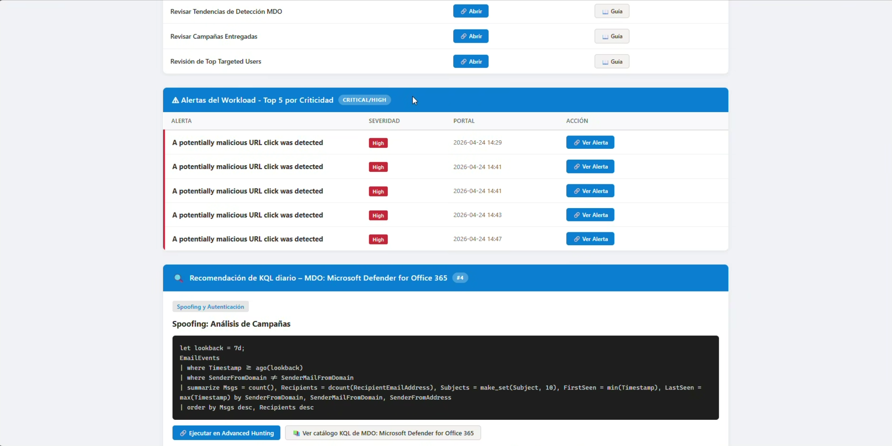

# Security Operations Guide  Microsoft 365 Defender XDR

**Authors:** Ernesto Cobos Roqueñí, Arturo Mandujano

> Security Operations (SecOps) framework for Microsoft Defender XDR with operational guides, automation scripts, configuration baselines, and KQL query packages.

---

## Project Description

This repository contains the complete security operations framework for organizations using **Microsoft 365 Defender XDR**. It provides:

- **Operational guides** (daily, weekly, and monthly) for each Defender pillar (MDO, MDE, MDI, MDA, Entra ID).
- **Automation scripts** in PowerShell for executive reports, configuration validation, and alert policy creation.
- **Security baselines** aligned with Microsoft recommendations (Standard/Strict).
- **KQL query packages** for Advanced Hunting focused on detection, triage, and investigation.
- **Automated HTML reports** (daily and weekly) that transform technical telemetry into actionable information for the CISO and SecOps team.




### Business Value

| Audience | Benefit |
|---|---|
| **CISO / Executive Leadership** | Clear exposure and risk KPIs, executive visibility without needing to access technical consoles |
| **SecOps Team** | Step-by-step guides for daily operations, automated scripts to reduce manual work |
| **Infrastructure Administrators** | Configuration validation against recommended baselines, tenant hygiene reports |

---

## Table of Contents

- [Requirements and Dependencies](#requirements-and-dependencies)
- [Microsoft Entra ID (Identity)](#microsoft-entra-id-identity)
- [Microsoft Defender for Office 365 (MDO)](#microsoft-defender-for-office-365-mdo)
- [Microsoft Defender for Endpoint (MDE)](#microsoft-defender-for-endpoint-mde)
- [Microsoft Defender for Identity (MDI)](#microsoft-defender-for-identity-mdi)
- [Microsoft Defender for Cloud Apps (MDA)](#microsoft-defender-for-cloud-apps-mda)
- [Microsoft Defender XDR (Cross-Domain Reports)](#microsoft-defender-xdr-cross-domain-reports)
- [Repository Structure](#repository-structure)

---

## Requirements and Dependencies

See [Requirements.md](Requirements.md) for the complete guide on:

- Microsoft 365 licensing (E5 or standalone Defender licenses)
- Execution environment (PowerShell 5.1+, required modules)
- App Registration in Entra ID (App Registration, API permissions, authentication modes)
- Credential configuration and Task Scheduler for automation

---

## Microsoft Entra ID (Identity)

Operational guides and tools for identity security management.

### Operational Guides

| Cadence | Document |
|---|---|
| Daily | [Daily Operations Guide - EntraID](EntraID/Daily%20Operations%20Guide.md) |
| Weekly | [Weekly Operations Guide - EntraID](EntraID/Weekly%20Operations%20Guide.md) |
| Monthly / Ad-hoc | [Monthly Operations Guide - EntraID Ad-Hoc](EntraID/Monthly%20Operations%20Guide%20-%20AdHoc%20Tasks.md) |

### Baselines

| Document | Description |
|---|---|
| [Baseline Conditional Access Policies](EntraID/Baseline/Baseline%20Conditional%20Access%20Policies.md) | Conditional Access policy templates (MFA for all users, break-glass exclusions, Report-only) |

### KQL Queries

| Document | Description |
|---|---|
| [KQL Query Package - EntraID Advanced Hunting](EntraID/KQL%20Query%20Package%20-%20EntraID%20Advanced%20Hunting.md) | Advanced Hunting queries focused on identity threat detection and investigation |

### Scripts

| Script | Description |
|---|---|
| [Get-ConditionalAccessPolicies.ps1](EntraID/Scripts/Get-ConditionalAccessPolicies.ps1) | Exports a detailed report of all Conditional Access Policies (console + CSV + HTML) |
| [Get-InactiveUsers.ps1](EntraID/Scripts/Get-InactiveUsers.ps1) | Lists users with no sign-in activity in the last N days via Microsoft Graph |
| [Get-M365RoleReport.ps1](EntraID/Scripts/Get-M365RoleReport.ps1) | Enumerates administrative role members in Entra ID, Security & Compliance, and Exchange Online |
| [Get-MFAAuthenticationMethodsReport.ps1](EntraID/Scripts/Get-MFAAuthenticationMethodsReport.ps1) | Audits MFA authentication methods for all users — [Documentation](EntraID/Scripts/MFA%20Report%20with%20Microsoft%20Graph.md) |

---

## Microsoft Defender for Office 365 (MDO)

Guides, baselines, policies, and scripts for email and collaboration security.

### Operational Guides

| Cadence | Document |
|---|---|
| Daily | [Daily Operations Guide MDO Daily Tasks](MDO/Daily%20Operations%20Guide%20MDO%20Daily%20Tasks.md) |
| Weekly | [Daily Operations Guide MDO Weekly](MDO/Daily%20Operations%20Guide%20MDO%20Weekly.md) |
| Monthly / Ad-hoc | [Daily Operations Guide MDO Monthly Ad-Hoc](MDO/Daily%20Operations%20Guide%20MDO%20Monthly%20Ad-Hoc.md) |

### Baselines

| Document | Description |
|---|---|
| [Baseline for Protection Against Business Email Compromise (BEC)](MDO/Baseline/Baseline%20for%20Protection%20Against%20Business%20Email%20Compromise%20(BEC).md) | Layered defense strategy against identity impersonation and business email compromise |
| [Baseline for Improving Security Posture in Exchange Online](MDO/Baseline/Baseline%20for%20Improving%20Security%20Posture%20in%20Exchange%20Online.md) | Mail flow security configuration under Zero Trust (SPF, DKIM, DMARC, MTA-STS) |

### Policies

| Document | Description |
|---|---|
| [Anti-Phishing Policy MDO](MDO/Policies/Anti-Phishing%20Policy%20MDO.md) | Step-by-step guide to create an Anti-Phishing policy with BEC protection for executives |
| [Safe Attachments Policy](MDO/Policies/Safe%20Attachments%20Policy.md) | Guide to create a Safe Attachments policy (sandbox detonation) |
| [Safe Links Policy](MDO/Policies/Safe%20Links%20Policy.md) | Guide to create a Safe Links policy focused on BEC URL protection |

### KQL Queries

| Document | Description |
|---|---|
| [KQL Query Package MDO Advance Hunting](MDO/KQL%20Query%20Package%20MDO%20Advance%20Hunting.md) | Detection, triage, and investigation queries for email threats |

### Scripts

| Script | Description |
|---|---|
| [New-CustomAlertPolicies.ps1](MDO/Scripts/New-CustomAlertPolicies.ps1) | Creates 23 custom Alert Policies (Threat Management, DLP, Access Governance, SharePoint) |
| [New-MailboxAuditBypassAlert.ps1](MDO/Scripts/New-MailboxAuditBypassAlert.ps1) | Creates an alert to detect execution of `Set-MailboxAuditBypassAssociation` |
| [Validate-MDOPolicies.ps1](MDO/Scripts/Validate-MDOPolicies.ps1) | Validates all MDO policies against Microsoft Standard/Strict recommendations |
| [Validate-EXOSecurityBaseline.ps1](MDO/Scripts/Validate-EXOSecurityBaseline.ps1) | Validates the Exchange Online security baseline (transport rules, SPF/DKIM/DMARC/MTA-STS) |
| [Validate-ZAPConfiguration.ps1](MDO/Scripts/Validate-ZAPConfiguration.ps1) | Validates Zero-hour Auto Purge (ZAP) configuration and generates an HTML dashboard |
| [Domain-Health-Check.ps1](MDO/Scripts/Domain-Health-Check.ps1) | Checks authentication DNS records (SPF, DKIM, DMARC, MTA-STS) and generates an HTML report |
| [Attachmentscannotbeinspected.ps1](MDO/Scripts/Attachmentscannotbeinspected.ps1) | Creates a transport rule to quarantine emails with non-inspectable attachments |
| [Block-OnMicrosoftEmails.ps1](MDO/Scripts/Block-OnMicrosoftEmails.ps1) | Creates a transport rule to block emails sent to `*.onmicrosoft.com` addresses |

---

## Microsoft Defender for Endpoint (MDE)

Operational guides and vulnerability reports for endpoint security.

### Operational Guides

| Cadence | Document |
|---|---|
| Daily | [Daily Operations Guide MDE Daily Tasks](MDE/Daily%20Operations%20Guide%20MDE%20Daily%20Tasks.md) |
| Weekly | [Daily Operations Guide MDE Weekly Tasks](MDE/Daily%20Operations%20Guide%20MDE%20Weekly%20Tasks.md) |

### Scripts

| Script | Description |
|---|---|
| [New-DefenderVulnerabilityReport.ps1](MDE/New-DefenderVulnerabilityReport.ps1) | Generates an executive HTML vulnerability report via M365 Defender API (CVEs, severity distribution, exploitability) |

---

## Microsoft Defender for Identity (MDI)

Operational guides and KQL queries for on-premises identity protection and lateral movement detection.

### Operational Guides

| Cadence | Document |
|---|---|
| Daily | [Daily Operations Guide - Microsoft Defender for Identity](MDI/Daily%20Operations%20Guide%20-%20Microsoft%20Defender%20for%20Identity.md) |
| Weekly | [Weekly Operations Guide - Microsoft Defender for Identity](MDI/Weekly%20Operations%20Guide%20-%20Microsoft%20Defender%20for%20Identity.md) |
| Monthly / Ad-hoc | [Monthly Operations Guide - Ad-Hoc - Microsoft Defender for Identity](MDI/Monthly%20Operations%20Guide%20-%20Ad-Hoc%20-%20Microsoft%20Defender%20for%20Identity.md) |

### KQL Queries

| Document | Description |
|---|---|
| [KQL Query Package - MDI Advanced Hunting](MDI/KQL%20Query%20Package%20-%20MDI%20Advanced%20Hunting.md) | Identity threat detection and investigation queries for MDI |

---

## Microsoft Defender for Cloud Apps (MDA)

> Section under development. Operational guides, baselines, and scripts for MDA will be included soon.

---

## Microsoft Defender XDR (Cross-Domain Reports)

Automated reports that consolidate telemetry from MDO, MDE, MDI, and MDA into executive HTML reports.

### Scripts

| Script | Description | Instructions |
|---|---|---|
| [New-DefenderXDRDailyReport.ps1](XDR/New-DefenderXDRDailyReport.ps1) | Generates a daily HTML report via Advanced Hunting API | [Instructions](XDR/Instructions%20New-DefenderXDRDailyReport.ps1.md) |
| [New-DefenderXDRWeeklyReport.ps1](XDR/New-DefenderXDRWeeklyReport.ps1) | Generates a weekly executive HTML report with KPIs and trends | [Instructions](XDR/Instructions%20New-DefenderXDRWeeklyReport.ps1.md) |
| [New-DefenderVulnerabilityReport.ps1](MDE/New-DefenderVulnerabilityReport.ps1) | Generates a vulnerability report (TVM) in HTML | [Instructions](XDR/Instructions%20New-DefenderVulnerabilityReport.ps1.md) |
| [Setup-DefenderXDRReportServer.ps1](XDR/Setup-DefenderXDRReportServer.ps1) | Initial server setup: folder structure, DPAPI/cert credentials, Task Scheduler for automation | — |

### Report Features

- **KPI Grid**: Key metrics (MDE Alerts, Phishing, High Risk Users) at the top
- **Domain sections**: MDO (campaigns and targeted users), MDE (alert severity), MDI (brute force and risk), MDA (OAuth and cloud apps)
- **Executive design**: Segoe UI-based interface, consistent with the Microsoft ecosystem
- **Automation**: Task Scheduler for daily (7:00 AM) and weekly (Monday 7:30 AM) execution

---

## Repository Structure

```
gol2026/
├── README.md                          ← This file
├── Requirements.md                    ← Requirements, licensing, and configuration
│
├── EntraID/                           ← Microsoft Entra ID (Identity)
│   ├── Operational guides (daily, weekly, monthly)
│   ├── Conditional Access Policies baseline
│   ├── KQL Advanced Hunting package
│   ├── Policies/
│   ├── Baseline/
│   └── Scripts/                       ← 4 scripts (CA policies, inactive users, roles, MFA)
│
├── MDO/                               ← Microsoft Defender for Office 365
│   ├── Operational guides (daily, weekly, monthly)
│   ├── Baselines (BEC, Exchange Online)
│   ├── KQL Advanced Hunting package
│   ├── Policies/                      ← Anti-Phishing, Safe Attachments, Safe Links
│   ├── Baseline/
│   └── Scripts/                       ← 8 scripts (alerts, validations, transport rules)
│
├── MDE/                               ← Microsoft Defender for Endpoint
│   ├── Operational guides (daily, weekly)
│   └── New-DefenderVulnerabilityReport.ps1
│
├── MDI/                               ← Microsoft Defender for Identity
│   ├── Operational guides (daily, weekly, monthly)
│   └── KQL Advanced Hunting package
│
├── MDA/                               ← Microsoft Defender for Cloud Apps
│   ├── Operational guides (daily, weekly, monthly)
│   └── KQL Advanced Hunting package
│
├── XDR/                               ← Cross-Domain Reports
│   ├── Execution instructions (.md)
│   ├── Reporting scripts (daily, weekly, setup)
│   └── Generated reports (.html)
│
└── wiki/                              ← Wiki (under development)
```

---

## Technologies Used

| Technology | Usage |
|---|---|
| **PowerShell 7+** | Automation, validation, and reporting scripts |
| **KQL (Kusto Query Language)** | Advanced Hunting queries in Microsoft 365 Defender |
| **Microsoft Graph API** | Identity, role, and authentication method queries |
| **Microsoft 365 Defender API** | Advanced Hunting, vulnerability reports |
| **Exchange Online PowerShell** | MDO policy validation and Exchange configuration |
| **HTML5 / CSS3** | Visual executive reports |

---

## Quick Start

```powershell
# 1. Install required modules
Install-Module ExchangeOnlineManagement -Scope CurrentUser
Install-Module Microsoft.Graph -Scope CurrentUser

# 2. Connect to services
Connect-ExchangeOnline
Connect-IPPSSession

# 3. Set environment variables for XDR reports
$env:AZURE_TENANT_ID     = "<your-tenant-id>"
$env:AZURE_CLIENT_ID     = "<your-client-id>"
$env:AZURE_CLIENT_SECRET  = "<your-client-secret>"

# 4. Generate a daily report
.\XDR\New-DefenderXDRDailyReport.ps1

# 5. Validate MDO policies
.\MDO\Scripts\Validate-MDOPolicies.ps1
```

> For the complete configuration including App Registration, certificates, and Task Scheduler, see [Requirements.md](Requirements.md).


PowerShell / Graph API (Optional): For automation and file generation.


## ⚙️ Configuration and Usage

### Option 1: Automated Configuration (Recommended for Servers)

```powershell
# 1. Run setup script
.\Setup-DefenderReportServer.ps1

# 2. Follow the configuration wizard
# - Enter Tenant ID and Client ID
# - Configure Client Secret (encrypted with DPAPI)
# - Validate API permissions

# 3. Run report
.\Run-DefenderXDRWeeklyReport.ps1
```

### Option 2: Manual Configuration

```powershell
# Clone the repository
git clone https://github.com/watchdogcode/gol2026

# Create SecureString for Client Secret
$Secret = Read-Host "Client Secret" -AsSecureString
$Secret | ConvertFrom-SecureString | Out-File "C:\Config\Secret.txt"

# Run report
$SecureSecret = Get-Content "C:\Config\Secret.txt" | ConvertTo-SecureString
.\New-DefenderXDRWeeklyReport.ps1 `
    -TenantId "your-tenant-id" `
    -ClientId "your-client-id" `
    -AuthMode Secret `
    -ClientSecret $SecureSecret `
    -UseParallel `
    -ExportCsv
```

### Prerequisites

- **Azure AD App Registration** with permissions:
  - `AdvancedHunting.Read.All` (Application)
  - Admin Consent granted
- **PowerShell 5.1** or higher (7+ recommended for parallel execution)
- **Required licenses**: Microsoft 365 E5 or Microsoft Defender XDR

## 🆕 New Features (v2.0)

### 🔒 Enhanced Security
- ✅ **SecureString** for Client Secret (local DPAPI encryption)
- ✅ **Masking** of Tenant ID in reports
- ✅ **Automatic cleanup** of sensitive variables in memory
- ✅ **Token caching** with automatic expiration

### ⚡ Performance
- ✅ **Parallel execution** of queries (up to 5x faster)
- ✅ **Authentication caching** (reuses valid tokens)
- ✅ **Exponential retries** with intelligent backoff

### 📊 Functionality
- ✅ **CSV export** of all tables
- ✅ **Comparison with previous period** (KPI trends)
- ✅ **Structured logging** with levels (INFO/WARN/ERROR/DEBUG)
- ✅ **Test mode** for testing without API

### 🛡️ Robustness
- ✅ **Granular error handling** (a single query failure doesn't break the whole report)
- ✅ **Data validation** before generating the report
- ✅ **Improved timeout** in Device Code flow
- ✅ **Configurable variables** (retry limits, thresholds)

See [IMPLEMENTED_IMPROVEMENTS.md](IMPLEMENTED_IMPROVEMENTS.md) for detailed documentation.

## 📁 Project Structure

```
gol2026/
├── New-DefenderXDRWeeklyReport.ps1      # Main script (v2.0)
├── New-DefenderXDRDailyReport.ps1       # Daily report
├── Setup-DefenderReportServer.ps1       # Automated setup
├── Run-DefenderXDRWeeklyReport.ps1      # Wrapper (generated by setup)
├── IMPLEMENTED_IMPROVEMENTS.md             # Improvements documentation
├── KQL Query Package Advance Hunting.md    # Reference KQL queries
├── Daily Operations Guide MDO...           # Operational guides
└── README.md                            # This file
```

## 🔧 Usage Examples

### Scheduled Execution (Task Scheduler)
```powershell
# Create weekly task (Monday 7 AM)
$Action = New-ScheduledTaskAction -Execute 'PowerShell.exe' `
    -Argument '-NoProfile -ExecutionPolicy Bypass -File "C:\Scripts\Run-DefenderXDRWeeklyReport.ps1"'
$Trigger = New-ScheduledTaskTrigger -Weekly -DaysOfWeek Monday -At 7am
Register-ScheduledTask -TaskName "DefenderXDR-WeeklyReport" `
    -Action $Action -Trigger $Trigger
```

### Advanced Usage
```powershell
# With all features
.\New-DefenderXDRWeeklyReport.ps1 `
    -TenantId "xxx" `
    -ClientId "yyy" `
    -AuthMode Secret `
    -ClientSecret $SecureSecret `
    -TimeWindowDays 14 `
    -UseParallel `
    -ExportCsv `
    -SendMail `
    -SmtpServer "smtp.office365.com" `
    -To "soc-team@empresa.com" `
    -LogPath "D:\Logs\Defender.log"
```

## ⚠️ Disclaimer

This report is a visualization tool. The data displayed depends on the correct configuration of Microsoft Defender XDR licenses and connectors in your environment.

**Created by:** Ernesto Cobos Roqueñi and Jose Arturo Mandujano  
**Version:** 2.1
**Last updated:** April 2026
